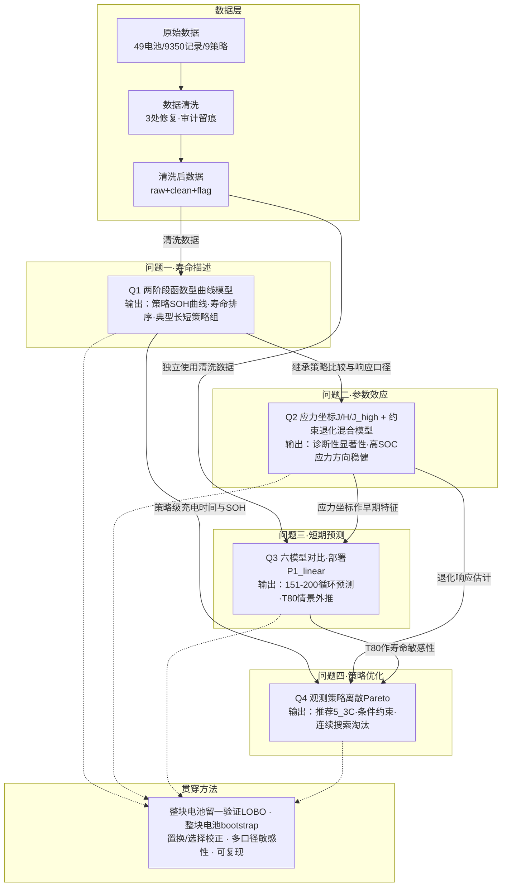

# 策联杯 A 题 四问方法链流程图

## 逻辑链说明

- **Q1 → Q2**：Q2 继承 Q1 的清洗结果、完整电池队列、策略类别比较与响应口径（SOH200）
- **Q2 → Q3**：Q2 的应力坐标（J/H/J_high）作为 Q3 早期特征的一部分
- **Q2 → Q4**：Q2 的退化响应估计是 Q4 的"寿命目标"
- **Q3 → Q4**：Q3 的 T80 作为 Q4 的寿命敏感性口径
- **Q1 → Q4**：Q1 的策略级充电时间与 SOH 表现是 Q4 的"时间目标"
- **贯穿**：所有问题共用留一验证、bootstrap、置换/选择校正等方法
