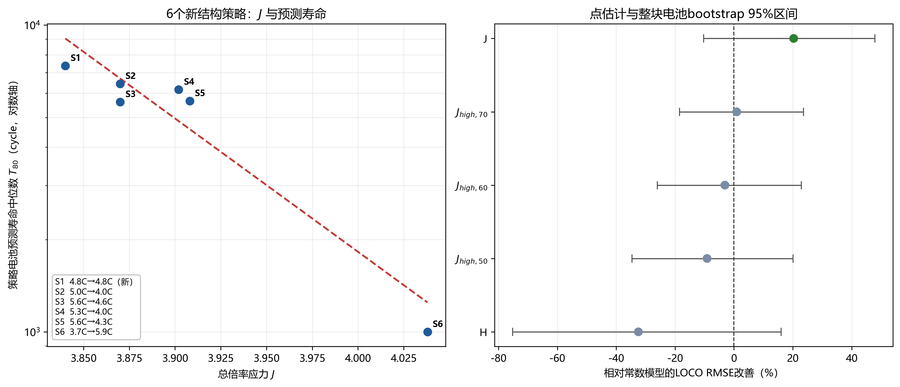

# 第二问：充电策略及其参数对循环寿命的影响

## 一、目标与模型

按出题组口径，循环寿命是SOH下降至80%时的预测循环数T80。本文沿用问题1的统一协议：49块电池均只使用前150循环，末段40循环窗口由40块完整电池的151—200循环回测选出，然后为每块电池估计T80。SOH150/200、相对损失和末段斜率仅作辅助证据。

策略寿命差异以电池级T80比较。参数效应分析限定在6个明确标注为新结构的策略，响应为策略内电池`log(T80)`均值；候选解释量为总倍率应力

\[
J=C_1Q_1+C_2(0.8-Q_1),
\]

SOC加权应力

\[
H=\frac12\left[C_1Q_1^2+C_2(0.8^2-Q_1^2)\right],
\]

以及50%、60%、70%以上的高SOC倍率暴露。每个候选只含一个暴露量，采用留一策略坐标验证；只有系数方向为负且RMSE优于常数模型时才可入选。2000次全流水线bootstrap每次重新抽取策略内整块电池、重新选择30—80循环寿命窗口、重算每块电池T80并重新选择参数模型；逐策略删除诊断和最大方向统计量排列用于检查稳定性。

## 二、小问1：不同策略的循环寿命差异

九种策略的T80中位数约为1000.8—8537.6循环。点排名前三为3.6C-80%-3.6C、4.8C-80%-4.8C（新结构）和5C-67%-4C（新结构）；末两位稳定为旧结构4.8C和3.7C-31%-5.9C（新结构）。

36组电池级T80双侧精确置换检验经Holm校正后为0组显著。每策略只有3—8块电池，T80又是早期趋势外推，因此该结论表示当前设计不能确认具体策略对差异，不表示九种策略寿命等价。

## 三、小问2：C1、Q1、C2与循环寿命的关系

点估计中，单变量`linear_J`在6个新结构策略上的留一策略RMSE为0.6416，较常数基线改善20.29%，系数方向表明总倍率应力J增大时`log(T80)`下降。该结果说明倍率在0%—80% SOC区间的累计暴露比孤立考察某一个倍率更有解释力。

但C1、Q1、C2由实验设计共同变化，6个策略无法稳定拆分三个参数的独立贡献。特别是同一(4.8,80%,4.8)坐标的新旧结构寿命差异很大，而结构与批次完全混杂，说明三个充电参数不是完整的寿命决定变量。

## 四、小问3：显著性和影响程度

不能确认独立显著效应。`linear_J`在2000次全流水线bootstrap中的入选频率为77.55%，但相对常数模型的RMSE改善95%区间为[-10.29%, 47.86%]，跨越0。寿命尾窗在1991次（99.55%）重采样中仍选择40循环、9次选择30循环。删除3.7C-31%-5.9C极端策略后，没有解释模型优于常数基线。

五个暴露量的最大方向统计量在720种策略标签排列下的尾部比例为0.1556。由于策略不是随机分配、策略均值样本量和方差不同，标签不可交换，该比例只作敏感性诊断，不能称为确认性p值或与0.05阈值直接比较。

因此可以报告`linear_J`的点关系及bootstrap稳定性，但不能把其斜率解释为可外推的因果效应量。

## 五、小问4：不同SOC区间的高倍率衰减特征

高SOC暴露`J_high_50/60/70`的全样本系数方向均为负，即高SOC倍率暴露增加时预测T80倾向缩短；但三种阈值的留一策略RMSE改善分别不稳定，且bootstrap区间均跨0。数据不支持把50%、60%或70%确定为真实物理临界SOC。

最稳定短寿命策略3.7C-31%-5.9C在31% SOC后升至5.9C，宽范围中高SOC高倍率与短T80相伴；5C-67%-4C和5.3C-54%-4C在中高SOC阶段降至4C，T80位于中上游。这为“中高SOC倍率需要控制”提供方向性证据，但极端策略删除后关联消失，不能推广为普遍阈值规律。

## 六、小问5：机制及局限

中高SOC下继续高倍率充电可能加剧极化、欧姆发热、界面副反应与析锂风险，从而增大活性锂损失并缩短寿命。该机理与数据方向一致，但题目没有直接测量析锂速率、局部过电位或副反应通量，因此机理只用于解释关联。

主要局限为：T80均为远期外推；策略设计稀疏且非随机；每策略电池数少；C1、Q1、C2共线；结构与批次混杂。全流水线bootstrap已经传播电池抽样、尾窗选择、T80重算与参数模型重选的不确定性，但仍不能创造新的参数坐标，也没有传播Q1模型族形式不确定性。结论应限定在题目电池、温度、倍率和既有策略邻域内。

图左显示6个新结构策略的J与预测T80，虚线为`linear_J`点拟合；纵轴采用真实对数坐标。图右给出各单暴露量模型相对常数基线的留一策略RMSE改善及全流水线bootstrap 95%区间。只有点估计的J模型明显为正，但区间跨0，直观展示了“存在方向线索、尚无确认性参数效应”的结论。
