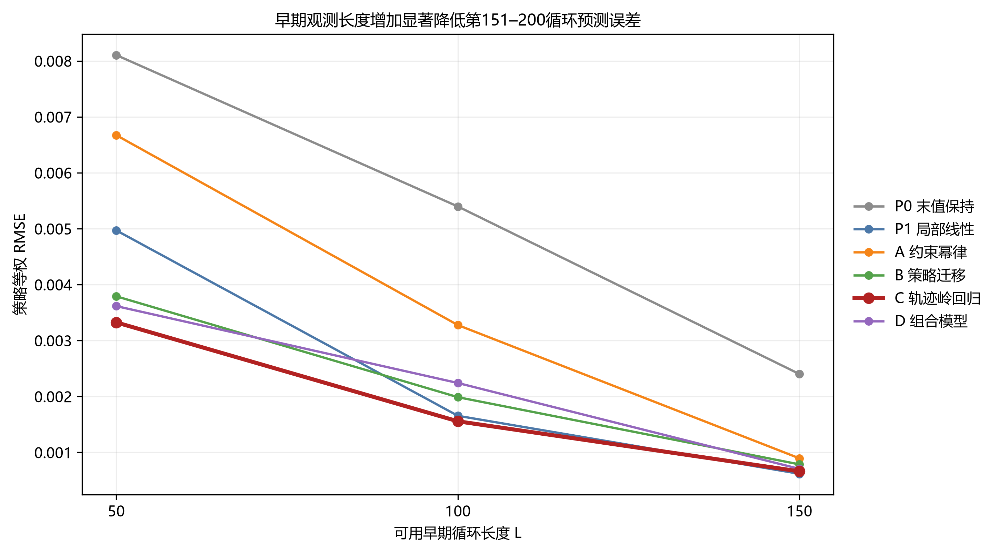
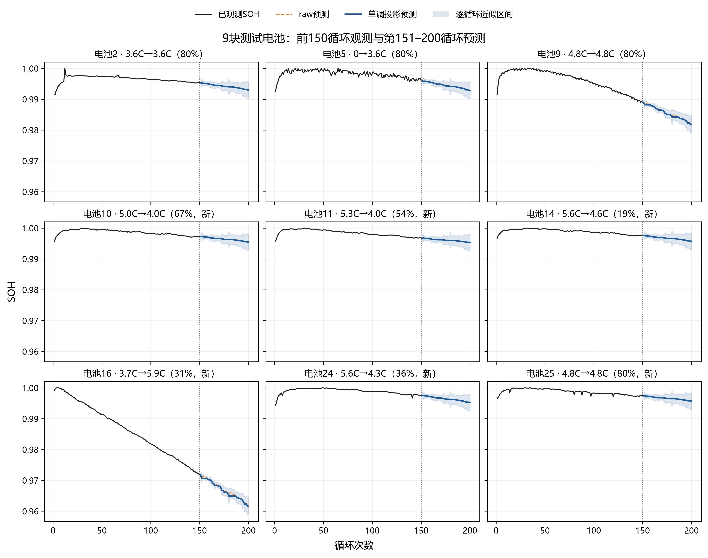
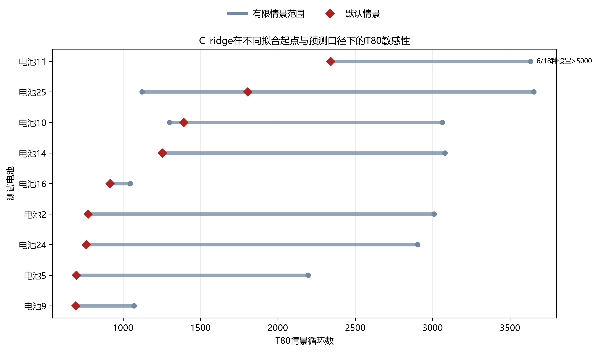

# 第三问完整回答与最终预测说明

## 最终方法

40块完整电池经过外层留一、折内调参和嵌套模型族选择后，冻结部署模型为`C_ridge`。随后只用全部40块完整电池重新调参/拟合，并读取9块测试电池的1—150循环前缀预测151—200循环。测试电池没有真实未来标签，因此不报告测试RMSE。

## 模型比较与早期长度

图Q3-1给出六个候选模型在L=50、100、150时的固定模型族外层LOBO策略等权RMSE。所有主要模型均随早期观测长度增加而改善；`C_ridge`按预先冻结的多长度综合指标胜出，但在L=150单点上`P1_linear`略优。因此最终模型应解释为多长度综合稳健最优，而不是每个长度下都最优。

## 九块测试电池结果

图Q3-2将前150循环清洗SOH与151—200循环预测拼接展示。虚线为raw预测，实线为单调投影预测，阴影是由40块完整电池的固定`C_ridge`外层LOBO残差逐循环校准得到的近似区间。该阴影不是整条50点轨迹的联合95%区间，也没有独立测试真值可用于覆盖率验证。

| 电池 | 策略 | 预测SOH200(raw) | 预测SOH200(projected) | SOH200近似95%区间 | 默认情景T80 | 状态 |
|---:|---|---:|---:|---|---:|---|
| 2 | 3_6C-80PER_3_6C | 0.993053 | 0.992989 | [0.990428, 0.995678] | 774.0 | finite_scenario |
| 5 | 80PER_3_6C | 0.992919 | 0.992809 | [0.990294, 0.995544] | 698.7 | finite_scenario |
| 9 | 4_8C_80PER_4_8C | 0.982070 | 0.981751 | [0.979445, 0.984695] | 694.1 | finite_scenario |
| 10 | 5C_67PER_4C_NEWSTRUCTURE | 0.995516 | 0.995479 | [0.992891, 0.998140] | 1391.1 | finite_scenario |
| 11 | 5_3C_54PER_4C_NEWSTRUCTURE | 0.995348 | 0.995331 | [0.992723, 0.997973] | 2341.6 | finite_scenario |
| 14 | 5_6C_19PER_4_6C_NEWSTRUCTURE | 0.995778 | 0.995740 | [0.993153, 0.998403] | 1253.7 | finite_scenario |
| 16 | 3_7C_31PER_5_9C_NEWSTRUCTURE | 0.962027 | 0.961550 | [0.959402, 0.964652] | 916.1 | finite_scenario |
| 24 | 5_6C_36PER_4_3C_NEWSTRUCTURE | 0.995283 | 0.995219 | [0.992658, 0.997908] | 761.1 | finite_scenario |
| 25 | 4_8C_80PER_4_8C_NEWSTRUCTURE | 0.995728 | 0.995697 | [0.993104, 0.998353] | 1804.8 | finite_scenario |

## 预测区间

区间由40块训练电池的外层交叉拟合绝对残差逐循环校准，是模型选择后的小样本近似区间，不是独立测试集覆盖率，也不能延伸解释为T80置信区间。

## EOL情景外推

图Q3-3展示冻结`C_ridge`在不同拟合起点和raw/projected口径下的有限T80范围，红色菱形为默认情景。电池11有6/18种设置超过5000循环，其他电池的有限范围也普遍较宽，说明T80对外推形式敏感。图中循环数只能作为情景交点，不能解释为已验证寿命或置信区间。

所有模型、raw/projected和多个拟合起点均保存在`eol_sensitivity.csv`。有限情景值范围为691.6—3653.0循环；由于49块电池均未观测到80% SOH，T80只表示模型情景，不具有实证寿命精度。跨窗口或模型差异较大时，应报告范围和状态而不是单一寿命。

## 可用结论

第三问能够用前50/100/150循环预测统一的151—200短期轨迹，并量化早期长度、策略信息和模型复杂度的作用；真正80%寿命仍受短观测窗口限制。论文中应把短期LOBO误差与远期T80不确定性分开陈述。
